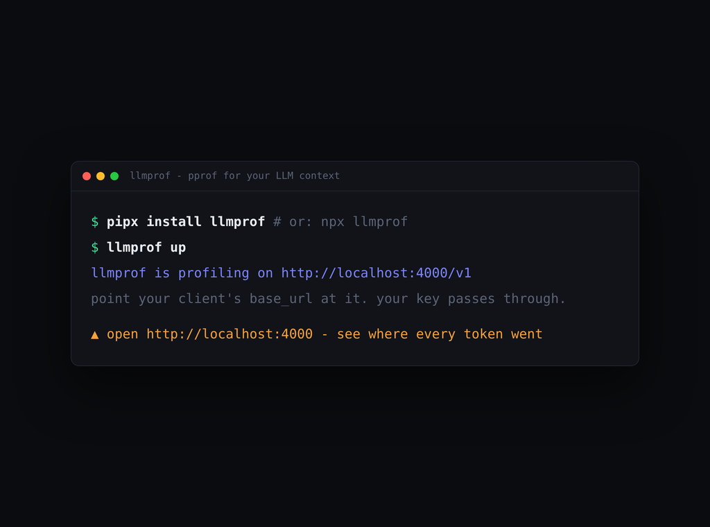
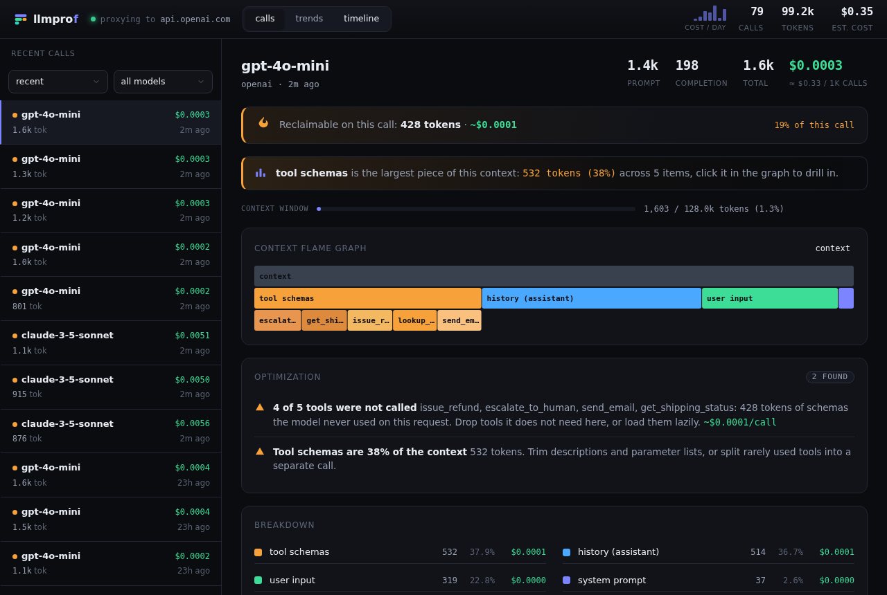
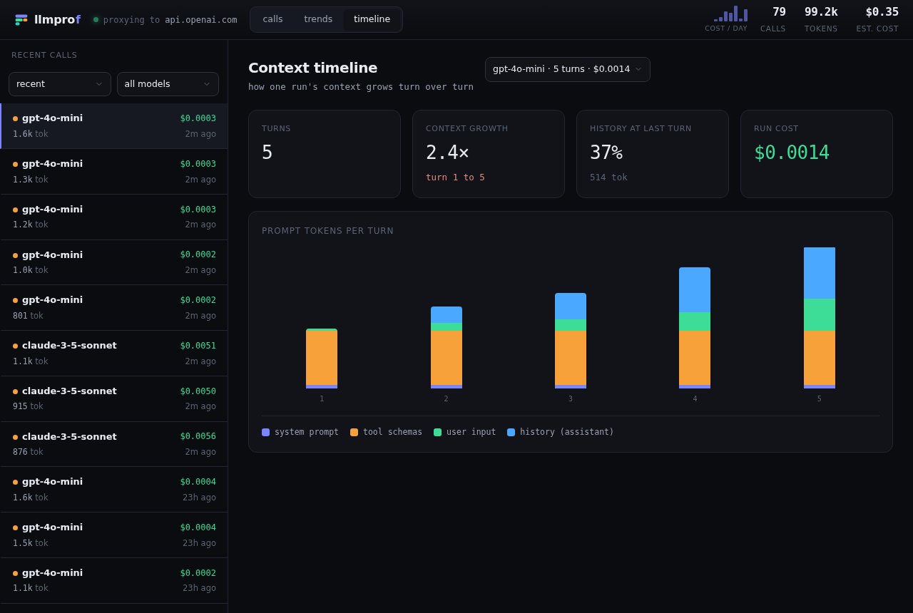

<h1 align="center">llmprof</h1>

<p align="center"><b>pprof for your LLM context.</b> See where every token and dollar goes.</p>

<p align="center">
  <a href="https://pypi.org/project/llmprof/"></a>
  <a href="https://www.npmjs.com/package/llmprof"></a>
  <a href="https://github.com/luthraG/llmprof/actions/workflows/ci.yml"></a>
  
  
  <a href="https://luthrag.github.io/llmprof"></a>
  <a href="https://luthrag.github.io/llmprof/try/"></a>
  
</p>

<p align="center">
  <b>&#9654; <a href="https://luthrag.github.io/llmprof/try/">Try the live dashboard in your browser</a></b> - no install, a real recorded session.
</p>

<p align="center">
  <a href="https://luthrag.github.io/llmprof/try/"></a>
</p>
<p align="center">
  <sub>lossless animation; a <a href="assets/demo.gif">GIF version</a> is also available &middot; <a href="https://luthrag.github.io/llmprof/try/">open the interactive demo</a></sub>
</p>

You profile CPU and memory. Why fly blind on the most expensive resource in your
AI app, the context window? Your billing page is a *meter* - it says how much you
spent. `llmprof` is a *profiler* - it says **where** each request's tokens went
(system prompt vs. tool schemas vs. RAG vs. history), prices the call,
flame-graphs it, and tells you what to cut.

```bash
pipx install llmprof && llmprof up      # or, no Python:  npx llmprof up
```

Point your client's base URL at `http://localhost:4000/v1` (your API key passes
straight through) and open `http://localhost:4000`.

> **Private by design.** llmprof is fully self-hosted: it runs on your machine
> (or your own server), and your prompts, completions, and API keys are only ever
> sent to the upstream provider you already use. Nothing is sent to llmprof, a
> third party, or any cloud. The trace database is a local file you own. Safe to
> run against production traffic and client data with no new data-sharing concerns.

## What you see

A flame graph of one request's tokens, with the optimization findings and the
dollars you can reclaim on the call:



The headline number across all your calls, projected to a month, plus day-over-day
trends and a most-expensive-prompts leaderboard:


Context creep across an agent's turns - history balloons while the system prompt
and tools stay flat:



## Quickstart

```python
from openai import OpenAI
client = OpenAI(base_url="http://localhost:4000/v1")  # the only change
client.chat.completions.create(model="gpt-4o", messages=[...], tools=[...])
```

One proxy profiles both providers (and Codex + Claude Code) at once - for
Anthropic just set the base URL (no `/v1`):

```python
from anthropic import Anthropic
client = Anthropic(base_url="http://localhost:4000")
```

Then open the dashboard, or `llmprof traces` for a terminal summary. Full docs:
**<https://luthrag.github.io/llmprof>**.

## Features

- **Context flame graph** - per-request token breakdown with per-tool drill-down.
- **Waste detector** - duplicated content, unused tool schemas, and uncached
  prefixes, rolled into a "$X/mo reclaimable" headline.
- **Context timeline** - how context grows turn over turn across an agent run.
- **Cost leaderboard** - which prompt template (system prompt + tools) drives the
  bill, not just which model.
- **Cost for 1000+ models** from a bundled LiteLLM snapshot (offline, no fetch),
  with curated rates for the newest flagships and `LLMPROF_PRICING` overrides.
- **Runs local**, single SQLite file, with a pluggable backend for a shared
  database.

## Works with

- **Any OpenAI-compatible API** via `/v1/chat/completions` and `/v1/responses`.
  Defaults to OpenAI; to use another (Azure, Groq, Together, OpenRouter, DeepSeek,
  Fireworks, Gemini's OpenAI endpoint, local Ollama / vLLM) set `--upstream`.
- **Anthropic** via `/v1/messages` (auto-routed, no flag needed).
- **[Claude Code](https://luthrag.github.io/llmprof/integrations/claude-code/)**
  and the **[Codex CLI](https://luthrag.github.io/llmprof/integrations/codex/)** -
  set their base URL to the proxy.
- **Any language** - the proxy is a local HTTP service; only the base URL changes.

## SDKs

When the proxy's heuristics are not enough, label components yourself for precise
attribution:

```python
# Python
import llmprof
with llmprof.profile(model="gpt-4o") as p:
    p.add("system prompt", system_text)
    p.add("rag_chunk", doc, name="kb#42")
    p.add("tool", search_schema, name="search", called=True)
    p.usage(resp.usage)
```

```js
// JavaScript / TypeScript  (npm i @llmprof/sdk)
import { profile } from "@llmprof/sdk";
await profile({ model: "gpt-4o" }, async (p) => {
  p.add("system prompt", systemText);
  p.add("rag_chunk", doc, { name: "kb#42" });
  p.add("tool", searchSchema, { name: "search", called: true });
  p.usage(resp.usage);
});
```

## How it works

The proxy forwards your request unchanged and streams the response straight back;
the analysis (tokenizing, attribution, pricing, waste detection) happens off the
hot path, so it adds essentially no latency. See the
[architecture](https://luthrag.github.io/llmprof/concepts/architecture/) docs for
the full picture.

## Configuration

| What | Flag | Env var | Default |
|------|------|---------|---------|
| Bind host | `--host` | `LLMPROF_HOST` | `127.0.0.1` |
| Bind port | `--port` | `LLMPROF_PORT` | `4000` |
| Upstream API | `--upstream` | `LLMPROF_UPSTREAM` | OpenAI |
| Price overrides | | `LLMPROF_PRICING` | built-in table |
| Data dir | | `LLMPROF_HOME` | `~/.llmprof` |
| Storage backend | | `LLMPROF_DB_URL` | SQLite (local file) |

## What llmprof is not

Not a full observability platform (no eval suite, prompt management, or hosted
cloud, that is Langfuse / Phoenix). `llmprof` is the focused **profiler**: where
your tokens go, and what to cut.

## Develop

```bash
python -m venv .venv && . .venv/bin/activate
pip install -e ".[dev]"
ruff check . && pytest
```

The dashboard is dependency-light vanilla JS/SVG; docs live in `docs/` (Astro
Starlight). See [Contributing](https://luthrag.github.io/llmprof/project/contributing/)
and the [changelog](CHANGELOG.md). Runnable [examples](examples/) cover both
providers and both SDKs.

## License

MIT (c) Gaurav Luthra
