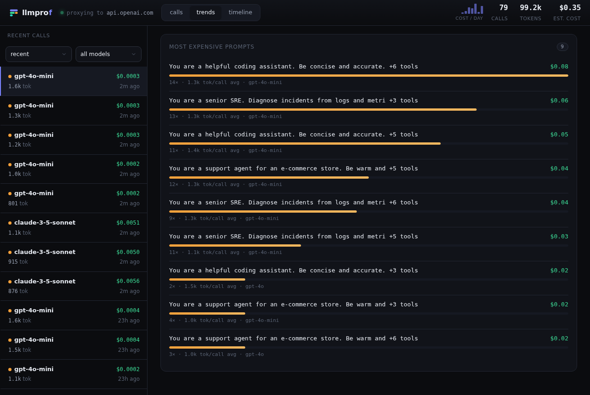

"Which model costs the most" is a blunt question. The more useful one is *which
recurring call shape* drives your bill - and that is what the cost leaderboard
answers.

## How templates are grouped

Each call is tagged with a **route** - a short signature of its reusable shape:
the start of the system prompt plus the set of tools it ships. Calls that share
that signature are the same template, even if the user message differs every
time.

The leaderboard groups by route and ranks by total cost, so a cheap-looking call
that runs thousands of times a day rises to the top where you can see it.

## Each row shows

- The template (system-prompt snippet + tool count).
- Total cost for that template.
- How many times it was called.
- Average tokens per call.

Find it on the [Trends](../trends/) view, just below the by-model breakdown.
