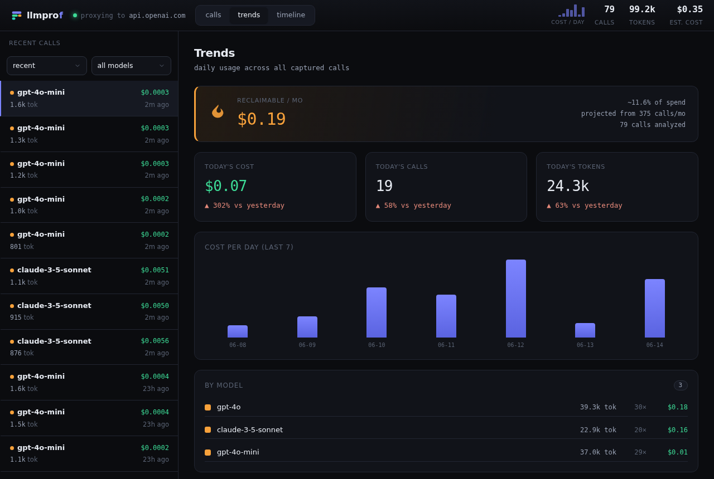

The Trends view zooms out from a single call to your usage over time.

## Reclaimable per month

The banner up top is the headline number: total reclaimable spend, projected to
a month from your observed call rate, with the percent of spend it represents and
how many calls it was computed from. See
[The waste detector](../../concepts/waste-detector/) for how it is calculated.

## Today vs yesterday

Three cards show today's cost, calls, and tokens, each with a delta against
yesterday so you can spot a sudden jump.

## Cost per day

A bar chart of cost for the last 14 days (the screenshot shows a 7-day window of
seeded data), so spend spikes are easy to see.

## By model

A breakdown of tokens, call count, and cost per model, most expensive first - a
quick answer to "which model is costing me the most?"

The [cost leaderboard](../leaderboard/) lives just below this, grouping by prompt
template rather than by model.
